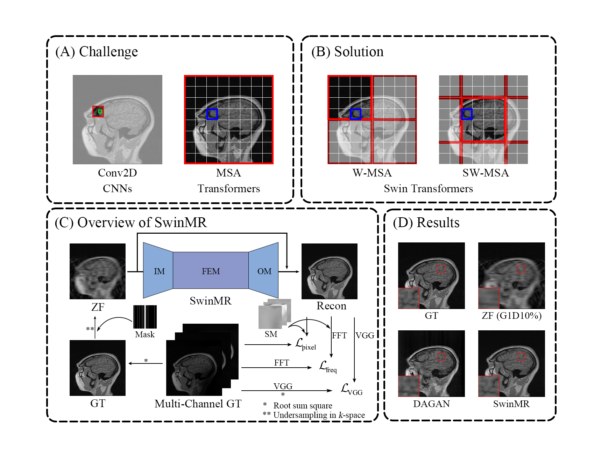

# SwinMR

by Jiahao Huang (j.huang21@imperial.ac.uk)

This is the official implementation of our proposed SwinMR:

Swin Transformer for Fast MRI

Please cite:

```
@article{HUANG2022281,
    title = {Swin transformer for fast MRI},
    journal = {Neurocomputing},
    volume = {493},
    pages = {281-304},
    year = {2022},
    issn = {0925-2312},
    doi = {https://doi.org/10.1016/j.neucom.2022.04.051},
    url = {https://www.sciencedirect.com/science/article/pii/S0925231222004179},
    author = {Jiahao Huang and Yingying Fang and Yinzhe Wu and Huanjun Wu and Zhifan Gao and Yang Li and Javier Del Ser and Jun Xia and Guang Yang},
    keywords = {MRI reconstruction, Transformer, Compressed sensing, Parallel imaging},
    abstract = {Magnetic resonance imaging (MRI) is an important non-invasive clinical tool that can produce high-resolution and reproducible images. However, a long scanning time is required for high-quality MR images, which leads to exhaustion and discomfort of patients, inducing more artefacts due to voluntary movements of the patients and involuntary physiological movements. To accelerate the scanning process, methods by k-space undersampling and deep learning based reconstruction have been popularised. This work introduced SwinMR, a novel Swin transformer based method for fast MRI reconstruction. The whole network consisted of an input module (IM), a feature extraction module (FEM) and an output module (OM). The IM and OM were 2D convolutional layers and the FEM was composed of a cascaded of residual Swin transformer blocks (RSTBs) and 2D convolutional layers. The RSTB consisted of a series of Swin transformer layers (STLs). The shifted windows multi-head self-attention (W-MSA/SW-MSA) of STL was performed in shifted windows rather than the multi-head self-attention (MSA) of the original transformer in the whole image space. A novel multi-channel loss was proposed by using the sensitivity maps, which was proved to reserve more textures and details. We performed a series of comparative studies and ablation studies in the Calgary-Campinas public brain MR dataset and conducted a downstream segmentation experiment in the Multi-modal Brain Tumour Segmentation Challenge 2017 dataset. The results demonstrate our SwinMR achieved high-quality reconstruction compared with other benchmark methods, and it shows great robustness with different undersampling masks, under noise interruption and on different datasets. The code is publicly available at https://github.com/ayanglab/SwinMR.}
}

```




## Highlight

- A novel Swin transformer-based model for fast MRI reconstruction was proposed.
- A multi-channel loss with sensitivity maps was proposed for reserving more details.
- Comparison studies were performed to validate the robustness of our SwinMR.
- A pre-trained segmentation network was used to validate the reconstruction quality.

## Requirements

matplotlib==3.3.4

opencv-python==4.5.3.56

Pillow==8.3.2

pytorch-fid==0.2.0

scikit-image==0.17.2

scipy==1.5.4

tensorboardX==2.4

timm==0.4.12

torch==1.9.0

torchvision==0.10.0

## Enhanced MRI Data Preparation and Training

### Quick Start with Enhanced Dataset (DICOM/JPG Support)

The enhanced system supports DICOM and standard image formats (JPG, PNG, BMP, TIFF) without requiring sensitivity maps.

#### 1. Structure Your Raw Data

Place your MRI data in any folder structure. The system will automatically find all supported files:

**Option A: Anatomy-based organization (recommended for your case):**
```
your_raw_data/
├── brain/
│   ├── brain_scan_001.dcm     # DICOM files
│   ├── brain_scan_002.dcm
│   ├── brain_mri_001.jpg      # JPG/PNG images
│   ├── brain_mri_002.png
│   └── ...
├── knee/
│   ├── knee_scan_001.dcm
│   ├── knee_scan_002.dcm
│   ├── knee_image_001.jpg
│   └── ...
├── spine/
│   ├── spine_001.dcm
│   ├── spine_002.jpg
│   └── ...
└── other_anatomy/
    ├── scan001.dcm
    ├── scan002.jpg
    └── ...
```

**Option B: Patient-based organization:**
```
your_raw_data/
├── patient001/
│   ├── series001/
│   │   ├── image001.dcm
│   │   └── ...
│   └── series002/
├── patient002/
└── ...
```

**Option C: Mixed or flat organization:**
```
your_raw_data/
├── all_scans/
│   ├── brain_001.dcm
│   ├── knee_001.jpg
│   ├── spine_001.png
│   └── ...
└── more_scans/
    └── ...
```

#### 2. Prepare Data for Training

```bash
# Option 1: Interactive setup (recommended for first-time users)
python organize_data.py interactive

# Option 2: Command line setup with custom target folder
python organize_data.py setup --base-path ./datahere
python organize_data.py prepare --source ./your_raw_data --target ./datahere

# Option 3: Use configuration file (modify organize_by_patient to false for anatomy-based data)
python organize_data.py prepare --config ./configs/data_prep_config.json
```

**Important for anatomy-based data:** When using the interactive setup, choose **"No"** when asked about organizing by patient, since your data is organized by anatomy type (brain, knee, etc.) rather than by patient ID.

This will create organized train/test folders in your desired location:
```
datahere/
├── train/
│   ├── img_train_000001_brain_brain_scan_001.npy
│   ├── img_train_000002_brain_brain_scan_002.npy
│   ├── img_train_000003_knee_knee_scan_001.npy
│   ├── img_train_000004_spine_spine_001.npy
│   └── ...
├── test/
│   ├── img_test_000001_brain_brain_mri_001.npy
│   ├── img_test_000002_knee_knee_image_001.npy
│   └── ...
└── metadata.json
```

#### 3. Configure Training

Create or modify your training configuration file:

```json
{
  "name": "swinmr_enhanced_training",
  "datasets": {
    "train": {
      "dataset_type": "enhanced",
      "dataroot_H": "./datahere/train",
      "use_enhanced_noise": true,
      "noise_config_path": "./configs/noise_config_default.json",
      "batch_size": 1,
      "use_shuffle": true,
      "n_workers": 4
    },
    "val": {
      "dataset_type": "enhanced", 
      "dataroot_H": "./datahere/test",
      "use_enhanced_noise": false
    }
  },
  "networks": {
    "netG": {
      "which_model_G": "swinmr",
      "in_nc": 1,
      "out_nc": 1,
      "nf": 180,
      "nb": 8
    }
  },
  "train": {
    "niter": 500000,
    "lr_G": 0.0002,
    "lr_scheme": "MultiStepLR",
    "lr_steps": [250000, 400000, 450000, 475000],
    "lr_gamma": 0.5
  },
  "path": {
    "pretrain_model_G": null,
    "experiments_root": "./experiments",
    "models": "./experiments/models",
    "training_state": "./experiments/training_state",
    "log": "./experiments",
    "val_images": "./experiments/val_images"
  }
}
```

**For anatomy-based data preparation, modify `data_prep_config.json`:**
```json
{
  "source_dir": "./your_raw_data",
  "target_dir": "./datahere", 
  "train_ratio": 0.8,
  "organize_by_patient": false,
  "min_size": [64, 64],
  "max_size": [512, 512],
  "normalize": true
}
```
*Note: Set `organize_by_patient: false` for anatomy-based folder structure*

#### 4. Start Training

```bash
# Train with enhanced dataset
python main_train_swinmr.py --opt ./options/SwinMR/example/train_swinmr_enhanced_dicom_jpg.json

# Monitor training progress
tensorboard --logdir ./experiments/tb_logger
```

#### 5. Noise Configuration Options

Choose from three predefined noise levels:

- **Mild**: `./configs/noise_config_mild.json` - Light noise for high-quality data
- **Default**: `./configs/noise_config_default.json` - Moderate noise for typical scenarios  
- **Aggressive**: `./configs/noise_config_aggressive.json` - Heavy noise for robust training

Or create custom noise configuration by modifying the JSON files.

#### Key Advantages of Enhanced Dataset:

✅ **No sensitivity maps required** - Simplified data requirements  
✅ **DICOM support** - Direct loading of medical imaging format  
✅ **Standard image formats** - JPG, PNG, BMP, TIFF support  
✅ **Realistic noise simulation** - 6 types of MRI artifacts  
✅ **Automatic organization** - Patient-aware train/test splitting  
✅ **Drop-in replacement** - Compatible with existing SwinMR code  

For detailed configuration options, see `ENHANCED_README.md`.

## Training and Testing
Use different options (json files) to train different networks.

### Enhanced Dataset Training and Testing

#### Training with Enhanced Dataset (DICOM/JPG):

```bash
# Train SwinMR with enhanced dataset
python main_train_swinmr.py --opt ./options/SwinMR/example/train_swinmr_enhanced_dicom_jpg.json
```

#### Testing with Enhanced Dataset:

```bash
# Test SwinMR with enhanced dataset  
python main_test_swinmr_CC.py --opt ./options/SwinMR/example/test/test_swinmr_enhanced_dicom_jpg.json
```

### Calgary Campinas multi-channel dataset (CC) 

To train SwinMR (PI) on CC:

`python main_train_swinmr.py --opt ./options/example/train_swinmr_CCpi_G1D30.json`

To test SwinMR (PI) on CC:

`python main_train_swinmr.py --opt ./options/example/train_swinmr_CCnpi_G1D30.json`

To train SwinMR (nPI) on CC:

`python main_test_swinmr_CC.py --opt ./options/example/test/test_swinmr_CCpi_G1D30.json`

To test SwinMR (nPI) on CC:

`python main_test_swinmr_CC.py --opt ./options/example/test/test_swinmr_CCnpi_G1D30.json`


This repository is based on:

SwinIR: Image Restoration Using Swin Transformer 
([code](https://github.com/JingyunLiang/SwinIR) and [paper](https://openaccess.thecvf.com/content/ICCV2021W/AIM/html/Liang_SwinIR_Image_Restoration_Using_Swin_Transformer_ICCVW_2021_paper.html));


Swin Transformer: Hierarchical Vision Transformer using Shifted Windows
([code](https://github.com/microsoft/Swin-Transformer) and [paper](https://openaccess.thecvf.com/content/ICCV2021/html/Liu_Swin_Transformer_Hierarchical_Vision_Transformer_Using_Shifted_Windows_ICCV_2021_paper.html)).

